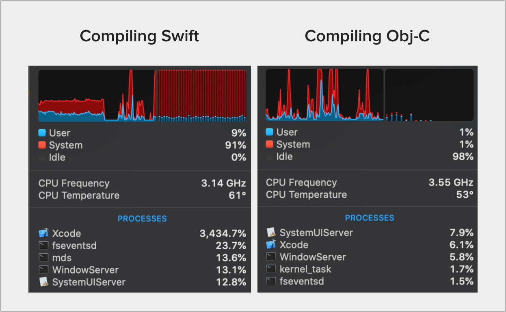

# A Really Dumb Xcode 11 Build Issue

> Stick with Objective-C, and you'll get the fastest builds, EVER!

Yeah, maybe not.

When I build my app, Xcode 11 appears to stall out completely (dropping from full core usage down to 10-20% CPU) during the Objective-C build phases.

In contrast, my *massive* Swift targets will happily peg my machine with *all* the cores/threads getting utilized. Swift doesn't get tripped up by this bug at all.



## Background

This project demonstrates a horrible bug in the Xcode 11 build system (which may be happening somewhere as deep as LLVM/clang).

The bug manifested for me like this:

1. Starting with a clean `DerivedData` folder, I can build my app, [Capo](https://supermegaultragroovy.com/products/capo) in about 60 seconds, flat.
2. Once I clean the build folder using command-shift-K, *all subsequent builds* will take anywhere from *180s* to *500s* (in the very worst case, which I've not seen for a while now.)

After some back & forth with Apple's engineers, I learned to turn on `clang`'s `-Rmodule-build` flag to see what's going on behind the scenes. It turns out that&mdash;for every Objective-C file that is built&mdash;framework modules are being re-built unnecessarily.

## Instructions

First, clone this repository:

```
git clone https://github.com/liscio/SubFrameworks
```

### Command-Line Version (Preferred/Faster)

Run the included `checkRebuilds.sh` script at the command-line. 

You will see pre-filtered output like this:

```
%%% Building Using Clean DerivedData %%%

SubFrameworks/SubFrameworks/SubB.h:9:9: remark: building module 'Foundation' as 'SubFrameworks/testDerivedData/ModuleCache.noindex/33MFFE8RLECJA/Foundation-2PSPYZLNW14KI.pcm' [-Rmodule-build]
SubFrameworks/SubFrameworks/SubB.h:9:9: remark: finished building module 'Foundation' [-Rmodule-build]
SubFrameworks/MainFramework/MainE.h:10:9: remark: building module 'SubFrameworks' as 'SubFrameworks/testDerivedData/ModuleCache.noindex/33MFFE8RLECJA/SubFrameworks-3U5BOV1R8307A.pcm' [-Rmodule-build]
SubFrameworks/MainFramework/MainE.h:10:9: remark: finished building module 'SubFrameworks' [-Rmodule-build]

%%% Clean re-build %%%

SubFrameworks/MainFramework/MainF.h:10:9: remark: building module 'SubFrameworks' as 'SubFrameworks/testDerivedData/ModuleCache.noindex/33MFFE8RLECJA/SubFrameworks-3U5BOV1R8307A.pcm' [-Rmodule-build]
SubFrameworks/MainFramework/MainF.h:10:9: remark: finished building module 'SubFrameworks' [-Rmodule-build]
SubFrameworks/MainFramework/MainG.h:10:9: remark: building module 'SubFrameworks' as 'SubFrameworks/testDerivedData/ModuleCache.noindex/33MFFE8RLECJA/SubFrameworks-3U5BOV1R8307A.pcm' [-Rmodule-build]
SubFrameworks/MainFramework/MainG.h:10:9: remark: finished building module 'SubFrameworks' [-Rmodule-build]
SubFrameworks/MainFramework/MainC.h:10:9: remark: building module 'SubFrameworks' as 'SubFrameworks/testDerivedData/ModuleCache.noindex/33MFFE8RLECJA/SubFrameworks-3U5BOV1R8307A.pcm' [-Rmodule-build]
SubFrameworks/MainFramework/MainC.h:10:9: remark: finished building module 'SubFrameworks' [-Rmodule-build]
SubFrameworks/MainFramework/MainD.h:10:9: remark: building module 'SubFrameworks' as 'SubFrameworks/testDerivedData/ModuleCache.noindex/33MFFE8RLECJA/SubFrameworks-3U5BOV1R8307A.pcm' [-Rmodule-build]
SubFrameworks/MainFramework/MainD.h:10:9: remark: finished building module 'SubFrameworks' [-Rmodule-build]
SubFrameworks/MainFramework/MainE.h:10:9: remark: building module 'SubFrameworks' as 'SubFrameworks/testDerivedData/ModuleCache.noindex/33MFFE8RLECJA/SubFrameworks-3U5BOV1R8307A.pcm' [-Rmodule-build]
SubFrameworks/MainFramework/MainE.h:10:9: remark: finished building module 'SubFrameworks' [-Rmodule-build]
SubFrameworks/MainFramework/MainA.h:10:9: remark: building module 'SubFrameworks' as 'SubFrameworks/testDerivedData/ModuleCache.noindex/33MFFE8RLECJA/SubFrameworks-3U5BOV1R8307A.pcm' [-Rmodule-build]
SubFrameworks/MainFramework/MainA.h:10:9: remark: finished building module 'SubFrameworks' [-Rmodule-build]
SubFrameworks/MainFramework/MainB.h:10:9: remark: building module 'SubFrameworks' as 'SubFrameworks/testDerivedData/ModuleCache.noindex/33MFFE8RLECJA/SubFrameworks-3U5BOV1R8307A.pcm' [-Rmodule-build]
SubFrameworks/MainFramework/MainB.h:10:9: remark: finished building module 'SubFrameworks' [-Rmodule-build]
```

#### What am I looking at here?

The script starts off by building the `MainFramework` target with a fresh, local `testDerivedData` folder.

The first block of output demonstrates that Xcode correctly builds modules for `Foundation`, and `SubFrameworks` only once. That is what the output should _always_ look like.

The second block of output is the result of asking `xcodebuild` to perform a `clean build` action. You'll notice that `Foundation` is not re-built, however `SubFrameworks` is built *for every single `.m` file in the `MainFramework` target. I would have expected to see it _only once_ since we are explicitly triggering its re-build.

Imagine that `SubFramework` contains your application's (extensive) core logic, and hundreds of source files. Now imagine that a good number of the source files in your main application `#import <SubFramework/SubFramework.h>`. For each of those source files, the `SubFramework` module is *re-compiled* again and again.

Crazy, right?! 

### Using Xcode

You can also reproduce the same result in Xcode 11.x, which is where I spend most of my time working.

Open the Xcode project, and do the following: 

1. Choose the MainFramework target
2. Build the product. You'll see warnings in the output that show which modules are being built.
3. Press Command-Shift-K to clear the build folder
4. Build the product again. You'll now see warnings indicating that the SubFramework module is re-built for each source file.

## Does the Xcode Version Matter?

Yes. This bug does not appear to affect Xcode 10.x. All of my installed Xcode 11.x releases (11.0 - 11.3 beta) are affected.

## Hey, Apple Folks!

For anybody that cares to look further into this, this specific issue is tracked by FB7046188.

What's especially frustrating is that I've been experiencing _terrible build performance_ since April 2018. See also FB5715747, and FB5642600.

## Affected Systems

I have only been able to test this on my iMac Pro, and a 2016 MacBook Pro. Both machines have experienced this bug on Mojave _and_ Catalina.

